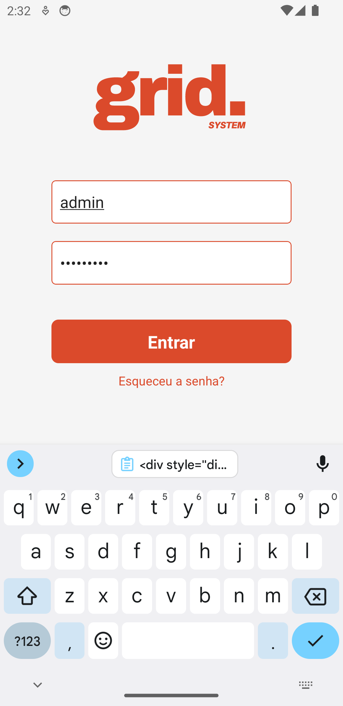

# Tela de Login em React Native

Este é um projeto simples de uma tela de login criada usando React Native. Ele pode ser utilizado como parte de um portfólio ou como base para um projeto maior.

## Capturas de Tela

<div style="display: flex;">
    
    
</div>
## Funcionalidades

- Entrada de usuário e senha
- Verificação simples de credenciais (usuário: `admin`, senha: `admin123`)
- Mensagem de erro para credenciais incorretas
- Teclado ajustável para iOS e Android

## Instalação

Para clonar e executar este aplicativo, você precisará do [Git](https://git-scm.com), [Node.js](https://nodejs.org/en/) e [React Native](https://reactnative.dev/docs/environment-setup) instalados em seu computador. A partir da linha de comando:

```bash
# Clone este repositório
$ git clone https://github.com/devraulbraga/telalogin
